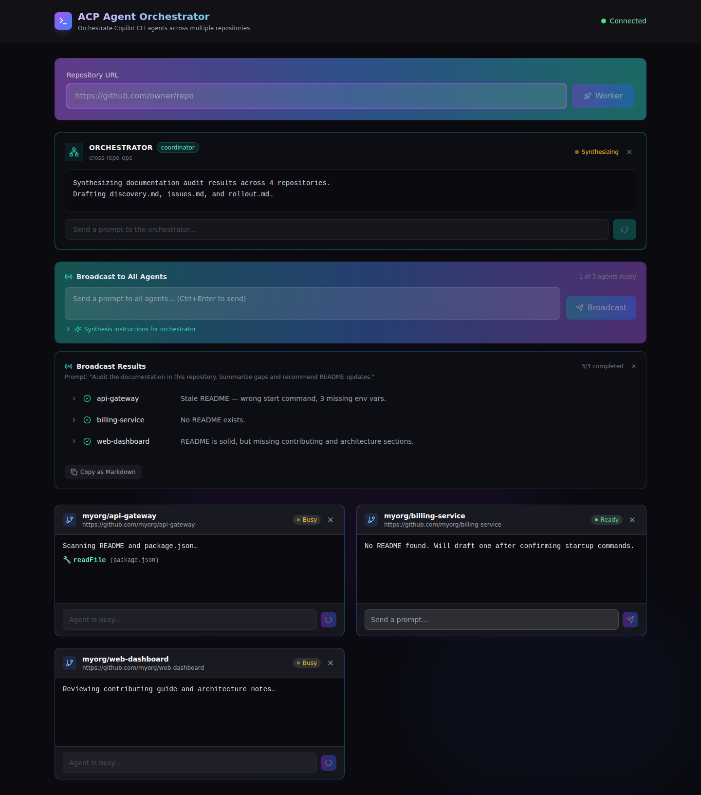

<div class="h-full flex flex-col items-center justify-center relative overflow-hidden">
  <!-- Gradient background -->
  <div class="absolute inset-0 bg-gradient-to-br from-violet-900/20 via-purple-900/10 to-indigo-900/20"></div>

  <!-- Glowing orb -->
  <div class="absolute top-1/4 left-1/2 -translate-x-1/2 -translate-y-1/2 w-96 h-96 bg-gradient-to-r from-violet-500/20 via-purple-500/20 to-indigo-500/20 rounded-full blur-3xl"></div>

  <!-- Logo with glow -->
  <div class="relative z-10">
    <div class="absolute inset-0 blur-2xl opacity-50">
      
    </div>
    
  </div>

  <!-- Gradient text title -->
  <h1 class="!text-5xl !font-bold !mt-8 bg-gradient-to-r from-violet-400 via-purple-400 to-indigo-400 bg-clip-text text-transparent relative z-10">
    Copilot ACP
  </h1>

  <!-- Pill subtitle -->
  <div class="mt-4 relative z-10">
    <span class="px-6 py-2 bg-gradient-to-r from-violet-600/80 to-purple-600/80 rounded-full text-white text-xl font-medium shadow-lg shadow-violet-500/25">
      The Agent Client Protocol for Universal AI Integration
    </span>
  </div>

  <!-- Tagline -->
  <div class="mt-8 text-lg opacity-70 relative z-10">
    ⏰ <strong>45 minutes</strong> • Developers • Platform Engineers • Tool Builders
  </div>

  <!-- Decorative line -->
  <div class="mt-6 w-32 h-1 bg-gradient-to-r from-transparent via-violet-400 to-transparent rounded-full relative z-10"></div>
</div>

---

# The Central Question

<div class="h-full flex items-center justify-center">
  <div class="max-w-4xl">
    <div class="text-6xl text-center mb-8">🤔</div>
    <div class="text-4xl font-bold text-center bg-gradient-to-r from-violet-400 to-purple-400 bg-clip-text text-transparent mb-6">
      "How do I integrate Copilot's agentic capabilities into any editor, tool, or workflow — not just VS Code?"
    </div>
    <div class="text-xl text-center opacity-80 mt-8">
      ACP is "LSP for AI agents" — the same shift that transformed language tooling, now applied to coding agents
    </div>
  </div>
</div>

---
layout: center
---

# 📖 Table of Contents

<div class="grid grid-cols-2 gap-6 mt-8">
  <div @click="$nav.go(7)" class="cursor-pointer p-6 bg-gradient-to-br from-violet-500/10 to-violet-600/5 rounded-xl border border-violet-500/30 hover:border-violet-400/60 transition-all hover:scale-105">
    <div class="text-3xl mb-2">🏗️</div>
    <div class="font-semibold text-lg">Protocol Architecture</div>
    <div class="text-sm opacity-70 mt-2">Four layers of standardization — the LSP analogy</div>
  </div>

  <div @click="$nav.go(11)" class="cursor-pointer p-6 bg-gradient-to-br from-purple-500/10 to-purple-600/5 rounded-xl border border-purple-500/30 hover:border-purple-400/60 transition-all hover:scale-105">
    <div class="text-3xl mb-2">🚀</div>
    <div class="font-semibold text-lg">Getting Started</div>
    <div class="text-sm opacity-70 mt-2">From zero to connected in 5 minutes</div>
  </div>

  <div @click="$nav.go(14)" class="cursor-pointer p-6 bg-gradient-to-br from-indigo-500/10 to-indigo-600/5 rounded-xl border border-indigo-500/30 hover:border-indigo-400/60 transition-all hover:scale-105">
    <div class="text-3xl mb-2">📦</div>
    <div class="font-semibold text-lg">SDK Ecosystem</div>
    <div class="text-sm opacity-70 mt-2">Build in TypeScript, Python, Rust, or Kotlin</div>
  </div>

  <div @click="$nav.go(16)" class="cursor-pointer p-6 bg-gradient-to-br from-fuchsia-500/10 to-fuchsia-600/5 rounded-xl border border-fuchsia-500/30 hover:border-fuchsia-400/60 transition-all hover:scale-105">
    <div class="text-3xl mb-2">🔒</div>
    <div class="font-semibold text-lg">Permissions & Security</div>
    <div class="text-sm opacity-70 mt-2">Trust without blind faith — enterprise-ready</div>
  </div>
</div>

---

# The Problem

<div class="grid grid-cols-2 gap-6 mt-4">

<div>

### Editor Lock-In & Fragmentation

<div class="text-sm space-y-2 mt-3">

**The N×M integration matrix**
- Every editor needs a custom plugin for every AI agent
- VS Code, JetBrains, Neovim, Zed — separate integrations
- Agent authors spend more time on glue code than AI

**No standard protocol**
- LSP solved this for language servers, DAP for debuggers
- AI agents have nothing — until ACP

</div>

</div>

<div>

### Automation Gaps

<div class="text-sm space-y-2 mt-3">

**CI/CD can't access agentic AI**
- No programmatic way to leverage agent capabilities
- Custom wiring required for every integration

**Teams locked to one editor**
- Full Copilot experience only in VS Code
- Terminal workflows, custom tools excluded

</div>

</div>

</div>

<div class="mt-4 p-3 bg-gradient-to-r from-red-600/40 to-orange-600/40 rounded-xl border border-red-500/50">
<div class="font-bold text-center text-sm">What's needed: a protocol that decouples editors from agents — like LSP did for language tooling</div>
</div>

---

# The Solution: Agent Client Protocol (ACP)

<div class="text-sm space-y-3 mt-4">

**Standardized communication between editors and AI agents via JSON-RPC 2.0**

<div class="grid grid-cols-2 gap-4 mt-3">

<div class="p-3 bg-violet-900/40 rounded-lg border border-violet-500/50">
<div class="text-xl mb-1">🌐</div>
<div class="font-semibold mb-1 text-sm">Universal Editor Support</div>
<div class="text-xs opacity-90">
Any ACP-compatible editor connects to Copilot — Zed, JetBrains, Neovim, Emacs
</div>
</div>

<div class="p-3 bg-purple-900/40 rounded-lg border border-purple-500/50">
<div class="text-xl mb-1">📡</div>
<div class="font-semibold mb-1 text-sm">Bidirectional Streaming</div>
<div class="text-xs opacity-90">
Real-time responses and inline permission requests as the agent works
</div>
</div>

<div class="p-3 bg-indigo-900/40 rounded-lg border border-indigo-500/50">
<div class="text-xl mb-1">🧠</div>
<div class="font-semibold mb-1 text-sm">Stateful Sessions</div>
<div class="text-xs opacity-90">
Persistent context across prompts — accumulates understanding
</div>
</div>

<div class="p-3 bg-fuchsia-900/40 rounded-lg border border-fuchsia-500/50">
<div class="text-xl mb-1">🔐</div>
<div class="font-semibold mb-1 text-sm">Permission-Mediated Security</div>
<div class="text-xs opacity-90">
Every tool invocation goes through explicit user approval — enterprise-ready
</div>
</div>

</div>

</div>

---
layout: center
---

# 🧠 The Core Insight

<div class="text-5xl mb-8">💡</div>

<div class="text-3xl font-bold bg-gradient-to-r from-violet-400 to-purple-400 bg-clip-text text-transparent mb-8">
From "each editor needs its own AI plugin"<br/>to "any editor connects to any agent through one standard protocol"
</div>

<div class="grid grid-cols-2 gap-6 mt-8 text-sm max-w-3xl mx-auto">

<div class="p-4 bg-red-900/30 rounded-lg border border-red-500/40">
<div class="font-semibold text-red-400 mb-2">❌ Before ACP</div>
<div class="opacity-80">N editors × M agents = N×M integrations</div>
<div class="text-xs opacity-60 mt-1">Custom glue code that breaks with every update</div>
</div>

<div class="p-4 bg-green-900/30 rounded-lg border border-green-500/40">
<div class="font-semibold text-green-400 mb-2">✅ After ACP</div>
<div class="opacity-80">N editors + M agents = N+M integrations</div>
<div class="text-xs opacity-60 mt-1">Each side implements the protocol once</div>
</div>

</div>

---
layout: center
name: protocol-architecture
---

<!-- 🎬 MAJOR SECTION: Protocol Architecture -->

<div class="text-center">
  <div class="text-6xl mb-6">🏗️</div>
  <h1 class="text-5xl font-bold bg-gradient-to-r from-violet-400 to-purple-400 bg-clip-text text-transparent">
    Protocol Architecture
  </h1>
  <div class="mt-4 text-xl opacity-70">Four layers of standardization — inspired by LSP's proven design</div>
</div>

---

# Four-Layer Architecture

<div class="grid grid-cols-2 gap-6 mt-4 text-sm">

<div class="space-y-3">

<div class="p-3 bg-violet-900/30 rounded-lg border border-violet-500/40">
<div class="font-bold text-violet-400 mb-1">1. Transport Layer</div>
<div class="text-xs opacity-90">JSON-RPC 2.0 over <strong>stdio</strong> (editors) or <strong>TCP</strong> (network tools)</div>
</div>

<div class="p-3 bg-purple-900/30 rounded-lg border border-purple-500/40">
<div class="font-bold text-purple-400 mb-1">2. Protocol Layer</div>
<div class="text-xs opacity-90">Bidirectional request/response — both client and agent initiate messages</div>
</div>

<div class="p-3 bg-indigo-900/30 rounded-lg border border-indigo-500/40">
<div class="font-bold text-indigo-400 mb-1">3. Session Layer</div>
<div class="text-xs opacity-90">Stateful context — history, working directory, MCP servers per session</div>
</div>

<div class="p-3 bg-fuchsia-900/30 rounded-lg border border-fuchsia-500/40">
<div class="font-bold text-fuchsia-400 mb-1">4. Application Layer</div>
<div class="text-xs opacity-90">Agent logic (AI) + Client UX (rendering, permission dialogs)</div>
</div>

</div>

<div>

### Start the Server

```bash
# stdio mode — for editor integration
copilot --acp --stdio

# TCP mode — for network tools
copilot --acp --port 3000
```

### Key Protocol Messages

```
Client → Agent:
  initialize, session/new, session/prompt

Agent → Client:
  requestPermission, sessionUpdate

Both directions:
  Notifications for progress & state
```

</div>

</div>

---

# Core Message Flow

<div class="mt-4 text-sm">

```
Client (Editor)                    Agent (Copilot CLI)
     │                                    │
     │──── initialize ──────────────────▶│  Capability negotiation
     │◀─── initializeResult ────────────│
     │                                    │
     │──── session/new ─────────────────▶│  Create workspace context
     │◀─── newSessionResult ────────────│
     │                                    │
     │──── session/prompt ──────────────▶│  Send user prompt
     │◀─── sessionUpdate (streaming) ───│  Stream response chunks
     │◀─── requestPermission ───────────│  Agent needs tool access
     │──── permissionResponse ──────────▶│  User approves/denies
     │◀─── sessionUpdate (streaming) ───│  Continue with result
     │◀─── promptResult ────────────────│  Response complete
     │                                    │
```

</div>

<div class="mt-2 grid grid-cols-3 gap-4 text-xs">
<div class="p-2 bg-violet-900/30 rounded-lg border border-violet-500/30 text-center">
<strong>JSON-RPC 2.0</strong><br/>Human-readable, debuggable
</div>
<div class="p-2 bg-purple-900/30 rounded-lg border border-purple-500/30 text-center">
<strong>Streaming Updates</strong><br/>Real-time response rendering
</div>
<div class="p-2 bg-indigo-900/30 rounded-lg border border-indigo-500/30 text-center">
<strong>Permission Mediation</strong><br/>Agents never act without approval
</div>
</div>

---

# ACP vs LSP vs MCP

<div class="mt-4">

| Aspect | ACP | MCP | LSP |
|--------|-----|-----|-----|
| **Purpose** | Editor ↔ Agent | Model ↔ Tool | Editor ↔ Language Server |
| **Best For** | Universal AI agent access | Extending agent capabilities | Code intelligence |
| **Sessions** | Stateful, persistent | Stateless per invocation | Stateful per workspace |
| **Transport** | JSON-RPC over stdio/TCP | JSON-RPC over stdio/SSE | JSON-RPC over stdio/TCP |
| **Analogy** | Any agent → any editor | Any tool → any model | Any language → any editor |

</div>

<div class="mt-4 p-3 bg-violet-900/30 rounded-lg border border-violet-500/40 text-sm">
<strong>Key relationship:</strong> ACP defines how <em>editors talk to agents</em>. MCP defines how <em>agents access tools</em>. They're complementary — ACP sessions configure MCP servers, giving agents tool access through a standard interface.
</div>

---
layout: center
name: getting-started
---

<!-- 🎬 MAJOR SECTION: Getting Started -->

<div class="text-center">
  <div class="text-6xl mb-6">🚀</div>
  <h1 class="text-5xl font-bold bg-gradient-to-r from-purple-400 to-indigo-400 bg-clip-text text-transparent">
    Getting Started
  </h1>
  <div class="mt-4 text-xl opacity-70">From zero to connected in 5 minutes</div>
</div>

---

# Step 1: Start the ACP Server

<div class="grid grid-cols-2 gap-6 mt-4 text-sm">

<div>

### Prerequisites

- GitHub Copilot subscription (Pro, Pro+, Business, Enterprise)
- Copilot CLI installed and authenticated
- Node.js v22+ for TypeScript SDK

### Launch

```bash
# Start in stdio mode (recommended)
copilot --acp --stdio

# Or TCP mode for network access
copilot --acp --port 3000
```

The `--acp` flag transforms Copilot CLI into a **protocol server**.

</div>

<div>

### Install the SDK

```bash
npm install @agentclientprotocol/sdk
```

### What You Get

<div class="space-y-2 mt-3 text-xs">
<div class="p-2 bg-green-900/30 rounded border border-green-500/30">✅ Initialize response with agent capabilities</div>
<div class="p-2 bg-green-900/30 rounded border border-green-500/30">✅ Session with unique <code>sessionId</code></div>
<div class="p-2 bg-green-900/30 rounded border border-green-500/30">✅ Streaming updates as agent processes</div>
<div class="p-2 bg-green-900/30 rounded border border-green-500/30">✅ Prompt result with <code>stopReason: "end_turn"</code></div>
</div>

</div>

</div>

---

# Step 2: Connect a Client

<div class="mt-4 text-xs">

```typescript
import * as acp from "@agentclientprotocol/sdk";
import { spawn } from "node:child_process";
import { Readable, Writable } from "node:stream";

async function main() {
  // Start Copilot CLI as ACP server
  const copilot = spawn("copilot", ["--acp", "--stdio"], {
    stdio: ["pipe", "pipe", "inherit"],
  });

  const stream = acp.ndJsonStream(
    Writable.toWeb(copilot.stdin!) as WritableStream<Uint8Array>,
    Readable.toWeb(copilot.stdout!) as ReadableStream<Uint8Array>
  );

  const client: acp.Client = {
    async requestPermission(params) {
      return { outcome: { outcome: "cancelled" } }; // Handle permissions
    },
    async sessionUpdate(params) {
      const update = params.update;
      if (update.sessionUpdate === "agent_message_chunk"
          && update.content.type === "text") {
        process.stdout.write(update.content.text); // Stream response
      }
    },
  };

  const connection = new acp.ClientSideConnection((_agent) => client, stream);
  await connection.initialize({
    protocolVersion: acp.PROTOCOL_VERSION, clientCapabilities: {},
  });

  const session = await connection.newSession({ cwd: process.cwd(), mcpServers: [] });
  await connection.prompt({
    sessionId: session.sessionId,
    prompt: [{ type: "text", text: "Explain the purpose of this project" }],
  });
}
```

</div>

---
layout: center
name: sdk-ecosystem
---

<!-- 🎬 MAJOR SECTION: SDK Ecosystem -->

<div class="text-center">
  <div class="text-6xl mb-6">📦</div>
  <h1 class="text-5xl font-bold bg-gradient-to-r from-indigo-400 to-blue-400 bg-clip-text text-transparent">
    SDK Ecosystem
  </h1>
  <div class="mt-4 text-xl opacity-70">Build in your language — four official SDKs</div>
</div>

---

# Multi-Language SDKs

<div class="mt-4 text-sm">

| SDK | Package | Install |
|-----|---------|---------|
| **TypeScript** | `@agentclientprotocol/sdk` | `npm i @agentclientprotocol/sdk` |
| **Python** | `agent-client-protocol` | `pip install agent-client-protocol` |
| **Rust** | `agent-client-protocol` | `cargo add agent-client-protocol` |
| **Kotlin** | `acp-kotlin` | Maven / Gradle |

</div>

<div class="mt-6 p-4 bg-indigo-900/30 rounded-lg border border-indigo-500/40 text-sm">
<strong>ACP + MCP complement each other:</strong>
<div class="mt-2 grid grid-cols-2 gap-4 text-xs">
<div>• <strong>ACP</strong> = how editors talk to agents</div>
<div>• <strong>MCP</strong> = how agents access tools</div>
<div>• ACP sessions <em>configure</em> MCP servers</div>
<div>• Client tells agent which tools are available</div>
</div>
</div>

---

# MCP Integration Through ACP

<div class="grid grid-cols-2 gap-6 mt-4 text-sm">

<div>

```typescript
// Sessions can configure MCP servers
const session = await connection.newSession({
  cwd: process.cwd(),
  mcpServers: [{
    name: "github",
    transport: {
      type: "stdio",
      command: "npx",
      args: ["-y",
        "@modelcontextprotocol/server-github"],
      env: {
        GITHUB_TOKEN: process.env.GITHUB_TOKEN
      },
    },
  }],
});
```

</div>

<div class="flex items-center">
<div class="p-4 bg-violet-900/30 rounded-lg border border-violet-500/40 text-xs space-y-3">
<div><strong>What this does:</strong></div>
<div>1. Creates an ACP session with a working directory</div>
<div>2. Attaches an MCP server (GitHub) for the agent to use</div>
<div>3. Agent can now access GitHub tools through the standard MCP interface</div>
<div class="mt-2 p-2 bg-green-900/20 rounded border border-green-500/30">The client controls which tools are available — agents request, users approve</div>
</div>
</div>

</div>

---
layout: center
name: permissions-security
---

<!-- 🎬 MAJOR SECTION: Permissions & Security -->

<div class="text-center">
  <div class="text-6xl mb-6">🔒</div>
  <h1 class="text-5xl font-bold bg-gradient-to-r from-fuchsia-400 to-pink-400 bg-clip-text text-transparent">
    Permissions & Security
  </h1>
  <div class="mt-4 text-xl opacity-70">Trust without blind faith — enterprise-ready permission model</div>
</div>

---

# The Permission Model

<div class="grid grid-cols-2 gap-6 mt-4 text-sm">

<div>

### Every Action Is Mediated

```
Agent: "I need to run `npm test`"
  ↓
Client: Shows permission dialog
  ↓
User: Approves (or denies)
  ↓
Agent: Executes (or adapts)
```

### Permission Strategies

<div class="space-y-1 mt-3 text-xs">
<div class="p-2 bg-violet-900/30 rounded border border-violet-500/30"><strong>Interactive</strong> — User reviews each request</div>
<div class="p-2 bg-purple-900/30 rounded border border-purple-500/30"><strong>Policy-based</strong> — Auto-approve reads, require approval for writes</div>
<div class="p-2 bg-indigo-900/30 rounded border border-indigo-500/30"><strong>Blocked</strong> — Auto-deny destructive operations</div>
</div>

</div>

<div>

### Enterprise Security

<div class="text-xs">

| Concern | ACP Solution |
|---------|-------------|
| Unauthorized access | Permission callback gates every operation |
| Command execution | Shell commands require explicit approval |
| Data exfiltration | Network operations mediated by client |
| Scope creep | Session-scoped; new session resets |
| Audit trail | Log all permission requests and outcomes |

</div>

<div class="mt-3 p-2 bg-green-900/30 rounded-lg border border-green-500/40 text-xs">
<strong>Architecturally enforced</strong> — agents cannot bypass the permission layer. It's not optional.
</div>

</div>

</div>

---

# Use Case: Zed Editor Integration

<div class="grid grid-cols-2 gap-6 mt-4 text-sm">

<div>

### The Problem

Zed users wanted Copilot's full agent experience — but a VS Code extension-compatible layer would take **months**.

### The Solution

Zed implemented ACP client support:

```bash
copilot --acp --stdio
```

### The Outcome

<div class="mt-3 space-y-1 text-xs">
<div class="p-2 bg-green-900/30 rounded border border-green-500/30">✅ Full agent experience — streaming, permissions, sessions</div>
<div class="p-2 bg-green-900/30 rounded border border-green-500/30">✅ <strong>2 weeks</strong> vs 3+ months custom build</div>
<div class="p-2 bg-green-900/30 rounded border border-green-500/30">✅ No maintenance burden when Copilot updates</div>
</div>

</div>

<div>

### When to Use ACP

<div class="text-xs">

```
Q: How do you want to use Copilot?
├─ "My preferred editor (not VS Code)"
│  → ACP with editor's built-in client
│
├─ "CI/CD automation"
│  → copilot -p (programmatic mode)
│
├─ "Custom tool or dashboard"
│  → ACP SDK (TS/Python/Rust/Kotlin)
│
└─ "Coordinate multiple agents"
   → ACP + MCP combined
```

</div>

</div>

</div>

---

# 🚀 ACP Agent Orchestrator

<div class="grid grid-cols-2 gap-6 mt-4 text-sm">

<div>

### Multi-Agent Coordination via ACP

The [**ACP Agent Orchestrator**](https://github.com/MSBart2/cli-acp) — a full web interface for orchestrating multiple Copilot agents across repositories.

<div class="space-y-2 mt-3 text-xs">
<div class="p-2 bg-violet-900/30 rounded border border-violet-500/30">🤖 One <code>copilot --acp --stdio</code> process per repo</div>
<div class="p-2 bg-purple-900/30 rounded border border-purple-500/30">📡 Broadcast prompts to all workers simultaneously</div>
<div class="p-2 bg-indigo-900/30 rounded border border-indigo-500/30">🔄 Coalesced results → auto-forwarded to orchestrator</div>
<div class="p-2 bg-fuchsia-900/30 rounded border border-fuchsia-500/30">📋 Issue/PR tracking loop across repos</div>
</div>

| Layer | Technology |
|-------|-----------|
| Backend | Node + Express + Socket.IO |
| Frontend | React + Vite + Tailwind |
| ACP | `@agentclientprotocol/sdk` |

</div>

<div>


<div class="mt-3 text-xs opacity-70 text-center">Multiple Copilot agents coordinating cross-repo work</div>

</div>

</div>

---

# Orchestrator in Action

<div class="grid grid-cols-2 gap-6 mt-3 text-sm">

<div>



<div class="mt-2 text-xs opacity-70 text-center">Coalesced broadcast results panel</div>

</div>

<div>

### Cross-Repo Documentation Audit

<div class="space-y-1 mt-2 text-xs">
<div class="p-1.5 bg-violet-900/20 rounded">1️⃣ <strong>Broadcast</strong> audit prompts to all workers</div>
<div class="p-1.5 bg-purple-900/20 rounded">2️⃣ <strong>Coalesce</strong> worker outputs automatically</div>
<div class="p-1.5 bg-indigo-900/20 rounded">3️⃣ <strong>Synthesize</strong> cross-repo findings</div>
<div class="p-1.5 bg-fuchsia-900/20 rounded">4️⃣ <strong>Create issues</strong> with coordinated tracking</div>
<div class="p-1.5 bg-violet-900/20 rounded">5️⃣ <strong>Generate PRs</strong> across all repos</div>
<div class="p-1.5 bg-purple-900/20 rounded">6️⃣ <strong>Merge coordination</strong> via orchestrator</div>
</div>

### Try It Yourself

```bash
git clone https://github.com/MSBart2/cli-acp.git
cd cli-acp/webapp
npm run install:all && npm run dev
```

</div>

</div>

---

# 🧠 Mental Model Shift

<div class="grid grid-cols-3 gap-3 mt-4 text-xs">

<div class="space-y-2">
<div class="font-bold text-green-400 text-sm mb-2">✅ Move Toward</div>
<div class="p-2 bg-green-900/20 rounded-lg border border-green-500/30">
<strong>Protocol-First</strong><br/>Standard interface eliminates per-editor maintenance
</div>
<div class="p-2 bg-green-900/20 rounded-lg border border-green-500/30">
<strong>Streaming Collaboration</strong><br/>Real-time responses, inline permission requests
</div>
<div class="p-2 bg-green-900/20 rounded-lg border border-green-500/30">
<strong>Session-Based Context</strong><br/>Accumulates understanding across prompts
</div>
<div class="p-2 bg-green-900/20 rounded-lg border border-green-500/30">
<strong>Permission-Mediated Trust</strong><br/>Enterprise security without losing capability
</div>
</div>

<div class="space-y-2">
<div class="font-bold text-yellow-400 text-sm mb-2">⚠️ Move Away From</div>
<div class="p-2 bg-yellow-900/20 rounded-lg border border-yellow-500/30">
<strong>Editor-Specific Plugins</strong><br/>N×M matrix doesn't scale — ACP reduces to N+M
</div>
<div class="p-2 bg-yellow-900/20 rounded-lg border border-yellow-500/30">
<strong>Text-Only CLI Parsing</strong><br/>Use structured JSON-RPC with typed schemas
</div>
<div class="p-2 bg-yellow-900/20 rounded-lg border border-yellow-500/30">
<strong>Single-Editor Lock-In</strong><br/>ACP makes any editor work with any agent
</div>
</div>

<div class="space-y-2">
<div class="font-bold text-red-400 text-sm mb-2">🛑 Move Against</div>
<div class="p-2 bg-red-900/20 rounded-lg border border-red-500/30">
<strong>Auto-Approving All Permissions</strong><br/>Defeats the security model
</div>
<div class="p-2 bg-red-900/20 rounded-lg border border-red-500/30">
<strong>Ignoring Session Lifecycle</strong><br/>Resource leaks — always handle teardown
</div>
</div>

</div>

---

# ✅ What You Can Do Today

<div class="grid grid-cols-3 gap-4 mt-4 text-sm">

<div>

### 15 Minutes

<div class="space-y-1.5 text-xs mt-2">
<div class="p-1.5 bg-green-900/20 rounded border border-green-500/20">
☑️ Verify CLI: <code>copilot --version</code>
</div>
<div class="p-1.5 bg-green-900/20 rounded border border-green-500/20">
☑️ Start ACP: <code>copilot --acp --stdio</code>
</div>
<div class="p-1.5 bg-green-900/20 rounded border border-green-500/20">
☑️ Read the official ACP server docs
</div>
</div>

</div>

<div>

### 1 Hour

<div class="space-y-1.5 text-xs mt-2">
<div class="p-1.5 bg-purple-900/20 rounded border border-purple-500/20">
☑️ Install TS SDK
</div>
<div class="p-1.5 bg-purple-900/20 rounded border border-purple-500/20">
☑️ Run the basic client example
</div>
<div class="p-1.5 bg-purple-900/20 rounded border border-purple-500/20">
☑️ Implement a simple permission policy
</div>
<div class="p-1.5 bg-purple-900/20 rounded border border-purple-500/20">
☑️ Try the multi-turn example
</div>
</div>

</div>

<div>

### 2-4 Hours

<div class="space-y-1.5 text-xs mt-2">
<div class="p-1.5 bg-violet-900/20 rounded border border-violet-500/20">
☑️ Clone & run ACP Agent Orchestrator
</div>
<div class="p-1.5 bg-violet-900/20 rounded border border-violet-500/20">
☑️ Build a custom ACP client
</div>
<div class="p-1.5 bg-violet-900/20 rounded border border-violet-500/20">
☑️ Policy-based permissions for your org
</div>
<div class="p-1.5 bg-violet-900/20 rounded border border-violet-500/20">
☑️ Integrate MCP servers through ACP
</div>
</div>

</div>

</div>

---

# Related Patterns

<div class="grid grid-cols-2 gap-6 mt-4 text-sm">

<div class="space-y-3">

### Complementary Features

<div class="p-3 bg-violet-900/30 rounded-lg border border-violet-500/30">
<div class="font-semibold">Copilot CLI</div>
<div class="text-xs opacity-80 mt-1">Terminal-native AI — ACP makes CLI capabilities available to other editors</div>
</div>

<div class="p-3 bg-purple-900/30 rounded-lg border border-purple-500/30">
<div class="font-semibold">MCP Apps</div>
<div class="text-xs opacity-80 mt-1">Build tools agents access through MCP — ACP sessions configure MCP servers</div>
</div>

<div class="p-3 bg-indigo-900/30 rounded-lg border border-indigo-500/30">
<div class="font-semibold">Copilot SDK</div>
<div class="text-xs opacity-80 mt-1">Lower-level API — ACP provides a higher-level protocol abstraction</div>
</div>

</div>

<div>

### Decision Flow

<div class="p-3 bg-gray-800/50 rounded-lg font-mono text-xs mt-3">
<div>Q: What's your actual goal?</div>
<div>├─ "Use Copilot in the terminal"</div>
<div>│  → Copilot CLI</div>
<div>├─ "Build tools agents can use"</div>
<div>│  → MCP Apps</div>
<div>├─ "Extend Copilot in VS Code"</div>
<div>│  → Copilot Hooks</div>
<div>└─ "Integrate into custom editor/tool"</div>
<div>   → <strong class="text-violet-400">This talk (ACP)</strong></div>
</div>

</div>

</div>

---

<div class="text-center mb-6">
<h1 class="text-4xl font-bold bg-gradient-to-r from-violet-400 to-purple-400 bg-clip-text text-transparent">📚 References</h1>
</div>

<div class="grid grid-cols-2 gap-8 text-sm">

<div class="space-y-4">

<div class="p-4 bg-violet-900/20 rounded-xl border border-violet-500/30">
<div class="font-semibold text-violet-400 mb-3">📖 Official Docs</div>
<div class="text-xs space-y-2 opacity-90">
<div class="flex items-start gap-2"><span class="text-violet-400 mt-0.5">›</span> <span><strong>Copilot CLI ACP Server</strong> — Server modes, integration examples, API</span></div>
<div class="flex items-start gap-2"><span class="text-violet-400 mt-0.5">›</span> <span><strong>ACP Protocol Overview</strong> — Full spec with message types and lifecycle</span></div>
<div class="flex items-start gap-2"><span class="text-violet-400 mt-0.5">›</span> <span><strong>ACP Spec Repository</strong> — Protocol schema, SDKs, community libs</span></div>
</div>
</div>

<div class="p-4 bg-indigo-900/20 rounded-xl border border-indigo-500/30">
<div class="font-semibold text-indigo-400 mb-3">🔗 Integrations</div>
<div class="text-xs space-y-2 opacity-90">
<div class="flex items-start gap-2"><span class="text-indigo-400 mt-0.5">›</span> <span><strong>Zed ACP Agent</strong> — Native Copilot via ACP</span></div>
<div class="flex items-start gap-2"><span class="text-indigo-400 mt-0.5">›</span> <span><strong>ACP Agent Orchestrator</strong> — Multi-repo coordination</span></div>
</div>
</div>

</div>

<div class="space-y-4">

<div class="p-4 bg-purple-900/20 rounded-xl border border-purple-500/30">
<div class="font-semibold text-purple-400 mb-3">📋 Blog Posts</div>
<div class="text-xs space-y-2 opacity-90">
<div class="flex items-start gap-2"><span class="text-purple-400 mt-0.5">›</span> <span><strong>ACP Support in Copilot CLI — Public Preview</strong> — Launch announcement</span></div>
<div class="flex items-start gap-2"><span class="text-purple-400 mt-0.5">›</span> <span><strong>Power Agentic Workflows in Your Terminal</strong> — Workflow patterns</span></div>
</div>
</div>

<div class="p-4 bg-fuchsia-900/20 rounded-xl border border-fuchsia-500/30">
<div class="font-semibold text-fuchsia-400 mb-3">🌐 Community</div>
<div class="text-xs space-y-2 opacity-90">
<div class="flex items-start gap-2"><span class="text-fuchsia-400 mt-0.5">›</span> <span><strong>agentclientprotocol.com</strong> — Protocol overview and architecture</span></div>
<div class="flex items-start gap-2"><span class="text-fuchsia-400 mt-0.5">›</span> <span><strong>The LSP for AI Agents</strong> — Industry analysis</span></div>
</div>
</div>

</div>

</div>

<div class="mt-4 text-center">
<span class="px-4 py-1.5 bg-violet-900/30 rounded-full text-xs opacity-70 border border-violet-500/20">docs.github.com/en/copilot/reference/acp-server • agentclientprotocol.com</span>
</div>

---
layout: center
class: text-center
---

<div class="text-6xl mb-8">🎉</div>

# Thank You!

<div class="text-2xl mt-6 opacity-80">
  The Agent Client Protocol for Universal AI Integration
</div>

<div class="mt-8 text-lg">
  <strong>Next Steps:</strong> Start an ACP server with <code>copilot --acp --stdio</code>
</div>

<div class="mt-6 text-sm opacity-70">
  Questions? Let's discuss universal AI agent integration
</div>
