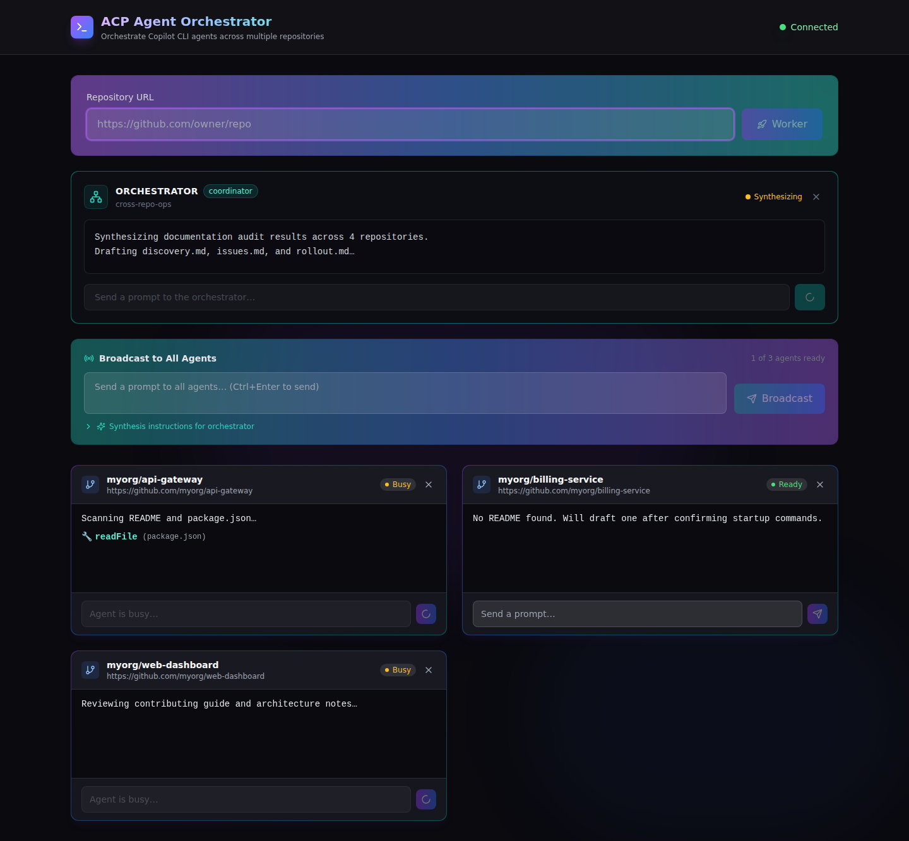

# GitHub Copilot ACP: The Agent Client Protocol for Universal AI Integration

> **The Question This Talk Answers:**
> *"How do I integrate GitHub Copilot's agentic capabilities into any editor, tool, or workflow — not just VS Code?"*

**Duration:** 45 minutes | **Target Audience:** Developers / Platform Engineers / Tool Builders

---

## 📊 Content Fitness

| Criterion | Assessment | Notes |
|-----------|-----------|-------|
| **Relevant** | 🟢 High | Teams locked to VS Code for Copilot access can now use it anywhere — Zed, JetBrains, Neovim, CI/CD, custom tools |
| **Compelling** | 🟢 High | ACP is "LSP for AI agents" — the same standardization shift that transformed language tooling, now applied to coding agents |
| **Actionable** | 🟢 High | Start a Copilot ACP server with one flag (`--acp`), connect with official SDKs in TypeScript, Python, Rust, or Kotlin |

**Overall Status:** 🟢 Ready to use

---

## 📽️ Slide Generation Mapping

### Slide Sequence (Generated Automatically)

1. **Title/Logo Slide** ← H1 title + subtitle
2. **Question/Objective Slide** ← "The Question This Talk Answers"
3. **Table of Contents Slide** ← Auto-generated from 🎬 sections
4. **Problem Slide** ← "The Problem"
5. **Solution Overview** ← "The Solution"
6. **Key Artifacts** ← Primary artifacts inventory
7. **🧠 The Shift (Preview)** ← Core Insight one-liner
8. **When to Use Decision Tree** ← "When to Use This Pattern"
9. **Protocol Architecture** ← 🎬 Section 1 (3-4 slides)
10. **Getting Started** ← 🎬 Section 2 (3-4 slides)
11. **SDK Ecosystem** ← 🎬 Section 3 (2-3 slides)
12. **Permissions & Security** ← 🎬 Section 4 (2-3 slides)
13. **Use Cases** ← Real-World Use Cases (2 slides)
14. **🧠 Mental Model Shift (Full)** ← Move Toward/Away/Against grid
15. **Actionable Outcomes** ← What You Can Do Today
16. **Related Patterns** ← Related Patterns
17. **📖 References** ← References section
18. **End Slide** ← Auto-generated

### Major Sections (TOC Entries)

```markdown
<!-- 🎬 MAJOR SECTION: Protocol Architecture -->
<!-- 🎬 MAJOR SECTION: Getting Started -->
<!-- 🎬 MAJOR SECTION: SDK Ecosystem -->
<!-- 🎬 MAJOR SECTION: Permissions & Security -->
```

---

## The Problem

### Key Points

- **Editor lock-in for AI assistance**
  Copilot's agentic capabilities are tightly coupled to specific editors — teams using Zed, JetBrains, Neovim, or Emacs cannot access the same agent experience [^1]

- **Bespoke integration per tool**
  Every IDE needs a custom plugin for each AI agent, creating an N×M integration matrix that fragments the ecosystem [^3]

- **No standard for agent communication**
  Unlike language servers (LSP) or debug adapters (DAP), there is no protocol standard for how editors talk to AI coding agents [^3]

- **Automation tooling gaps**
  CI/CD pipelines and custom developer tools cannot programmatically leverage Copilot's agent capabilities without custom wiring [^1]

### Narrative

The AI coding assistant landscape has a fragmentation problem. Every editor needs its own plugin for every AI agent — VS Code needs one integration, JetBrains needs another, Neovim needs yet another. This N×M integration matrix means that agent authors spend more time building editor-specific glue code than improving their AI capabilities, while editors must maintain separate integrations for each agent.

For teams that have standardized on terminal workflows, non-VS Code editors, or custom developer tools, accessing Copilot's full agent experience requires either switching editors or building bespoke integrations. CI/CD pipelines that want programmatic access to agentic AI face the same challenge — there's no standard way to connect. What's needed is a protocol that decouples editors from agents the same way LSP decoupled editors from language tooling — a universal standard that makes any editor work with any agent out of the box. [^3] [^4]

---

## The Solution: Agent Client Protocol (ACP)

### What It Does

The Agent Client Protocol (ACP) standardizes communication between code editors (clients) and AI coding agents (servers) using JSON-RPC 2.0 over stdio or TCP. [^1] GitHub Copilot CLI implements ACP as a server, enabling any ACP-compatible client — editors, CI/CD pipelines, or custom tools — to leverage Copilot's full agentic capabilities through a single, open protocol. [^2]

### Key Capabilities

- **Universal editor support**: Any ACP-compatible editor connects to Copilot without custom plugins — Zed, JetBrains, Neovim, Emacs, and more [^1] [^6]
- **Bidirectional streaming**: Real-time, interactive communication where agents stream responses and request permissions as they work [^4]
- **Stateful sessions**: Persistent conversation context across multiple prompts within a session — no need to re-explain context [^4]
- **Permission-mediated security**: Every tool invocation goes through explicit user approval, maintaining trust boundaries [^1]
- **Multi-language SDK ecosystem**: Official SDKs in TypeScript, Python, Rust, and Kotlin for building custom integrations [^5]

### Architecture Overview

ACP follows a four-layer architecture inspired by LSP's proven design. The **Transport Layer** handles newline-delimited JSON-RPC messages over stdio (recommended for editors) or TCP (for network integrations). The **Protocol Layer** orchestrates JSON-RPC request/response patterns with bidirectional communication. The **Session Layer** manages session lifecycle — creation, context maintenance, and teardown — enabling stateful, multi-turn interactions. The **Application Layer** is where agent logic (Copilot's AI capabilities) and client UX (editor rendering) live. [^4]

The core message flow follows a clear lifecycle: the client initializes by advertising its capabilities, the agent responds with its features, a session is created with workspace context (working directory, MCP servers), prompts are sent and responses streamed in real-time, and permission requests are mediated through the client. This design ensures agents never perform unauthorized actions — the editor always brokers tool access between the agent and user. [^1] [^4]

**Official Documentation:**
- 📖 [Copilot CLI ACP Server Reference](https://docs.github.com/en/copilot/reference/acp-server) — Server modes, integration examples, and API [^1]
- 📖 [ACP Protocol Overview](https://agentclientprotocol.com/protocol/overview) — Full specification and message types [^4]
- 📖 [ACP Architecture](https://agentclientprotocol.com/get-started/architecture) — Four-layer model and design principles [^7]

---

## 📽️ Visual Assets

*Architecture diagrams and protocol comparisons will be generated during slide creation using styled HTML components.*

**Planned visual assets:**
- ACP four-layer architecture diagram (Transport → Protocol → Session → Application)
- Client ↔ Agent message flow sequence diagram
- ACP vs LSP analogy comparison
- Permission mediation flow
- SDK ecosystem overview (TypeScript, Python, Rust, Kotlin)

---

## 📦 Key Artifacts

**Primary Artifacts** — *Shown inline in major sections with detailed explanation*

- **`copilot --acp --stdio`** — Command to start Copilot CLI as an ACP server in stdio mode
- **[`examples/basic-client.ts`](examples/basic-client.ts)** — TypeScript client that initializes connection, creates session, and sends prompts
- **[`examples/permission-handling.ts`](examples/permission-handling.ts)** — Permission request handling with user approval patterns
- **[`examples/multi-turn.ts`](examples/multi-turn.ts)** — Multi-turn conversation maintaining session context
- **[`examples/tcp-client.py`](examples/tcp-client.py)** — Python client demonstrating cross-language SDK usage over TCP

### Supporting Files

*Available in repository and official documentation*

- **[`examples/mcp-integration.ts`](examples/mcp-integration.ts)** — Connecting MCP servers through ACP sessions
- **[ACP TypeScript SDK](https://www.npmjs.com/package/@agentclientprotocol/sdk)** — Official npm package for building clients [^5]
- **[ACP Protocol Schema](https://github.com/agentclientprotocol/agent-client-protocol/tree/main/schema)** — JSON schema for message validation [^5]

---

## 🎯 Mental Model Shift

> **The Core Insight:** From "each editor needs its own AI plugin" to "any editor connects to any agent through one standard protocol"

### Move Toward (Embrace These Patterns)

- ✅ **Protocol-First Integration**: Use ACP to connect editors and agents through a standard interface → Eliminates per-editor plugin maintenance, enables editor freedom [^3]
- ✅ **Streaming Collaboration**: Leverage bidirectional streaming for real-time agent interaction → Responses appear as they're generated, permission requests handled inline [^4]
- ✅ **Session-Based Context**: Maintain conversation state across prompts within a session → No re-explaining context, accumulates understanding over the session [^4]
- ✅ **Permission-Mediated Trust**: Let the editor broker tool access between agent and user → Enterprise-ready security without sacrificing agent capability [^1]
- ✅ **Multi-Language SDKs**: Build integrations in your team's preferred language → TypeScript, Python, Rust, or Kotlin SDKs available [^5]

### Move Away From (Retire These Habits)

- ⚠️ **Editor-Specific Plugins**: Building and maintaining separate integrations for each editor → N×M matrix doesn't scale; ACP reduces to N+M [^3]
- ⚠️ **Text-Only CLI Parsing**: Scraping CLI output text for programmatic integration → Use structured JSON-RPC messages with typed schemas instead [^4]
- ⚠️ **Single-Editor Lock-In**: Requiring VS Code for Copilot's full capabilities → ACP makes the same agent experience available in any compatible editor [^6]

### Move Against (Active Resistance Required)

- 🛑 **Auto-Approving All Permissions**: Implementing `requestPermission` to approve everything blindly → Defeats the security model; review and scope each tool invocation [^1]
- 🛑 **Ignoring Session Lifecycle**: Creating sessions without cleanup or error handling → Resource leaks and orphaned processes; always handle session teardown [^1]

> **Example Transformation:** Before: Building Copilot support in Zed requires reverse-engineering VS Code's extension protocol and maintaining custom glue code — 3 months of work that breaks with each Copilot update. After: Zed implements ACP client support once, connects to `copilot --acp --stdio`, and gets full agent capabilities immediately — 2 weeks of work that stays compatible across updates. [^6]

---

## When to Use This Pattern

### Decision Tree

```
Q: How do you want to use Copilot's agent capabilities?
├─ "In my preferred editor (not VS Code)"
│  → Use: ACP with editor's built-in ACP client
│  └─ Best for: Zed, JetBrains, Neovim users wanting full agent experience
│
├─ "In CI/CD or automation pipelines"
│  → Use: Copilot CLI programmatic mode (-p flag)
│  └─ Best for: Headless automation; ACP not needed for simple commands
│
├─ "Build a custom tool or dashboard"
│  → Use: ACP SDK (TypeScript/Python/Rust/Kotlin)
│  └─ Best for: Custom frontends, developer portals, specialized workflows
│
└─ "Coordinate multiple AI agents"
   → Combine: ACP for agent communication + MCP for tool access
   └─ Best for: Multi-agent systems with shared tooling
```

### Use This Pattern When

- Integrating Copilot into non-VS Code editors (Zed, JetBrains, Neovim, Emacs)
- Building custom developer tools that need programmatic access to AI agent capabilities
- Creating specialized CI/CD automation that requires interactive agent sessions
- Coordinating multiple AI coding agents through a standard protocol
- Your team wants editor choice without sacrificing AI capabilities

### Don't Use This Pattern When

- Already using VS Code with Copilot extension → Built-in integration is simpler, no ACP needed
- Only need simple command-line AI → Use `copilot -p` programmatic mode directly (see [Copilot CLI talk](../copilot-cli/))
- Building MCP servers/tools → Use MCP protocol instead (see [MCP Apps talk](../mcp-apps/))
- Need code completion only → Editor-native Copilot extensions handle this without ACP

### Comparison with Related Features

| Aspect | ACP | MCP | LSP |
|--------|-----|-----|-----|
| **Purpose** | Editor ↔ Agent communication | Model ↔ Tool integration | Editor ↔ Language Server |
| **Best For** | Universal AI agent access | Extending agent capabilities | Code intelligence features |
| **Sessions** | Stateful, persistent | Stateless per invocation | Stateful per workspace |
| **Transport** | JSON-RPC over stdio/TCP | JSON-RPC over stdio/SSE | JSON-RPC over stdio/TCP |
| **Analogy** | Plug any agent into any editor | Plug any tool into any model | Plug any language into any editor |

---

<!-- 🎬 MAJOR SECTION: Protocol Architecture -->
## Protocol Architecture: Four Layers of Standardization

*How ACP decouples editors from agents the same way LSP decoupled editors from language servers*

### The LSP Analogy

Before LSP, every editor needed a custom integration for every programming language — an N×M problem. LSP solved this by standardizing the communication protocol, reducing it to N+M: each editor implements the client once, each language implements the server once. [^3]

ACP applies the same principle to AI coding agents:

| Before ACP | After ACP |
|-----------|----------|
| Each editor builds custom plugin for each agent | Each editor implements ACP client once |
| Agent authors maintain N editor-specific integrations | Agent authors implement ACP server once |
| N editors × M agents = N×M integrations | N editors + M agents = N+M integrations |
| Updates break per-editor glue code | Protocol versioning ensures compatibility |

### Four-Layer Architecture

ACP organizes communication into four distinct layers [^4] [^7]:

**1. Transport Layer** — Newline-delimited JSON-RPC 2.0 messages
```bash
# stdio mode — recommended for editor integration
copilot --acp --stdio

# TCP mode — for network-based tools and dashboards
copilot --acp --port 3000
```

**2. Protocol Layer** — Bidirectional request/response orchestration
- Client → Agent: `initialize`, `session/new`, `session/prompt`
- Agent → Client: `requestPermission`, `sessionUpdate`
- Both directions: Notifications for progress and state changes

**3. Session Layer** — Stateful context management
- Sessions maintain conversation history across prompts
- Working directory and MCP server configuration per session
- Multiple concurrent sessions on a single connection

**4. Application Layer** — Business logic
- Agent side: AI model interaction, code analysis, tool execution
- Client side: UI rendering, permission dialogs, output formatting

### Core Message Flow

```
Client (Editor)                    Agent (Copilot CLI)
     │                                    │
     │──── initialize ──────────────────▶│  Capability negotiation
     │◀─── initializeResult ────────────│
     │                                    │
     │──── session/new ─────────────────▶│  Create workspace context
     │◀─── newSessionResult ────────────│
     │                                    │
     │──── session/prompt ──────────────▶│  Send user prompt
     │◀─── sessionUpdate (streaming) ───│  Stream response chunks
     │◀─── sessionUpdate (streaming) ───│
     │◀─── requestPermission ───────────│  Agent needs tool access
     │──── permissionResponse ──────────▶│  User approves/denies
     │◀─── sessionUpdate (streaming) ───│  Continue with result
     │◀─── promptResult ────────────────│  Response complete
     │                                    │
     │──── session/cancel ──────────────▶│  Optional: cancel mid-response
     │                                    │
```

**Key Points:**
- Every message follows JSON-RPC 2.0 format for broad tooling compatibility [^4]
- Streaming updates enable real-time response rendering in editors
- Permission requests are always mediated by the client — agents never act without approval [^1]

---

<!-- 🎬 MAJOR SECTION: Getting Started -->
## Getting Started: From Zero to Connected in 5 Minutes

*Start a Copilot ACP server and connect your first client*

### Prerequisites

- GitHub Copilot subscription (Pro, Pro+, Business, or Enterprise) [^2]
- Copilot CLI installed and authenticated (`copilot` available in PATH) [^2]
- Node.js v22+ for TypeScript SDK examples [^5]

### Step 1: Start the ACP Server

```bash
# Verify Copilot CLI is installed
copilot --version

# Start in stdio mode (recommended)
copilot --acp --stdio

# Or start in TCP mode for network access
copilot --acp --port 3000
```

The `--acp` flag transforms Copilot CLI from an interactive terminal tool into a protocol server that any ACP client can connect to. [^1]

### Step 2: Connect with the TypeScript SDK

Install the official SDK [^5]:
```bash
npm install @agentclientprotocol/sdk
```

Create a basic client (from [official GitHub documentation](https://docs.github.com/en/copilot/reference/acp-server)) [^1]:

```typescript
import * as acp from "@agentclientprotocol/sdk";
import { spawn } from "node:child_process";
import { Readable, Writable } from "node:stream";

async function main() {
  const executable = process.env.COPILOT_CLI_PATH ?? "copilot";

  // Start Copilot CLI as ACP server (stdio transport)
  const copilotProcess = spawn(executable, ["--acp", "--stdio"], {
    stdio: ["pipe", "pipe", "inherit"],
  });

  if (!copilotProcess.stdin || !copilotProcess.stdout) {
    throw new Error("Failed to start Copilot ACP process with piped stdio.");
  }

  // Create NDJSON stream over stdio
  const output = Writable.toWeb(copilotProcess.stdin) as WritableStream<Uint8Array>;
  const input = Readable.toWeb(copilotProcess.stdout) as ReadableStream<Uint8Array>;
  const stream = acp.ndJsonStream(output, input);

  // Define client callbacks
  const client: acp.Client = {
    async requestPermission(params) {
      // Handle agent's tool permission requests
      return { outcome: { outcome: "cancelled" } };
    },
    async sessionUpdate(params) {
      const update = params.update;
      // Stream agent responses to stdout
      if (update.sessionUpdate === "agent_message_chunk"
          && update.content.type === "text") {
        process.stdout.write(update.content.text);
      }
    },
  };

  // Initialize connection and negotiate capabilities
  const connection = new acp.ClientSideConnection((_agent) => client, stream);
  await connection.initialize({
    protocolVersion: acp.PROTOCOL_VERSION,
    clientCapabilities: {},
  });

  // Create session with workspace context
  const sessionResult = await connection.newSession({
    cwd: process.cwd(),
    mcpServers: [],
  });

  // Send a prompt
  const promptResult = await connection.prompt({
    sessionId: sessionResult.sessionId,
    prompt: [{ type: "text", text: "Explain the purpose of this project" }],
  });

  // Cleanup
  copilotProcess.stdin.end();
  copilotProcess.kill("SIGTERM");
}

main().catch(console.error);
```

### Step 3: Verify the Connection

A successful connection produces:
1. **Initialize response** with agent capabilities and protocol version
2. **New session** with a unique `sessionId` for subsequent prompts
3. **Streaming updates** as the agent processes your prompt
4. **Prompt result** with `stopReason: "end_turn"` on completion

**Key Points:**
- The `sessionUpdate` callback receives streamed response chunks in real-time
- The `requestPermission` callback mediates all tool access — you control what the agent can do
- Sessions maintain context: subsequent prompts in the same session build on prior conversation

---

<!-- 🎬 MAJOR SECTION: SDK Ecosystem -->
## SDK Ecosystem: Build in Your Language

*Official SDKs in four languages for building ACP clients and agents*

### Available SDKs

| SDK | Package | Install | Repository |
|-----|---------|---------|------------|
| **TypeScript** | `@agentclientprotocol/sdk` | `npm install @agentclientprotocol/sdk` | [typescript-sdk](https://github.com/agentclientprotocol/typescript-sdk) [^5] |
| **Python** | `agent-client-protocol` | `pip install agent-client-protocol` | [python-sdk](https://github.com/agentclientprotocol/python-sdk) [^8] |
| **Rust** | `agent-client-protocol` | `cargo add agent-client-protocol` | [rust-sdk](https://github.com/agentclientprotocol/rust-sdk) [^9] |
| **Kotlin** | `acp-kotlin` | Maven/Gradle | [kotlin-sdk](https://github.com/agentclientprotocol/kotlin-sdk) [^10] |

### Cross-Language Example: Python TCP Client

```python
# Connect to Copilot ACP server over TCP (Python SDK)
import asyncio
from agent_client_protocol import Client, connect_tcp

async def main():
    # Connect to a running ACP server on TCP port
    async with connect_tcp("localhost", 3000) as connection:
        # Initialize with capability negotiation
        await connection.initialize()

        # Create a session with workspace context
        session = await connection.new_session(cwd="/path/to/project")

        # Send prompt and collect response
        result = await connection.prompt(
            session_id=session.session_id,
            prompt="Analyze the test coverage in this project"
        )

        print(f"Response: {result.text}")
        print(f"Stop reason: {result.stop_reason}")

asyncio.run(main())
```

### MCP Server Integration Through ACP

ACP sessions can configure MCP servers, giving the agent access to external tools [^1]:

```typescript
// Create session with MCP servers for extended capabilities
const sessionResult = await connection.newSession({
  cwd: process.cwd(),
  mcpServers: [
    {
      name: "github",
      transport: {
        type: "stdio",
        command: "npx",
        args: ["-y", "@modelcontextprotocol/server-github"],
        env: { GITHUB_TOKEN: process.env.GITHUB_TOKEN },
      },
    },
    {
      name: "filesystem",
      transport: {
        type: "stdio",
        command: "npx",
        args: ["-y", "@modelcontextprotocol/server-filesystem", "/workspace"],
      },
    },
  ],
});
```

This is the key relationship between ACP and MCP: **ACP defines how editors talk to agents, while MCP defines how agents access tools.** They are complementary protocols, not competitors. [^4] [^11]

**Key Points:**
- All SDKs implement the same protocol — clients built in any language connect to any ACP server
- TypeScript SDK is the reference implementation with the most examples [^5]
- Community libraries also available for Go, Elixir, and other languages [^5]

---

<!-- 🎬 MAJOR SECTION: Permissions & Security -->
## Permissions & Security: Trust Without Blind Faith

*How ACP's permission model enables enterprise adoption of AI agents*

### The Permission Model

Every tool invocation by the agent flows through the client's `requestPermission` callback. The agent proposes an action, the client presents it to the user (or applies policy), and the result determines whether the agent proceeds. [^1]

```
Agent: "I need to run `npm test` to verify changes"
  ↓
Client: Shows permission dialog to user
  ↓
User: Approves (or denies with explanation)
  ↓
Agent: Executes (or adapts approach)
```

### Permission Strategies

**Interactive approval** — User reviews each request:
```typescript
const client: acp.Client = {
  async requestPermission(params) {
    console.log(`Agent wants to: ${params.tool}`);
    console.log(`Arguments: ${JSON.stringify(params.arguments)}`);

    // Present to user and collect response
    const approved = await promptUser(`Allow ${params.tool}?`);
    return {
      outcome: { outcome: approved ? "approved" : "cancelled" },
    };
  },
};
```

**Policy-based approval** — Automated rules for known-safe operations:
```typescript
const SAFE_TOOLS = ["read_file", "list_directory", "search_code"];
const BLOCKED_TOOLS = ["delete_file", "execute_command"];

async requestPermission(params) {
  if (SAFE_TOOLS.includes(params.tool)) {
    return { outcome: { outcome: "approved" } };  // Auto-approve reads
  }
  if (BLOCKED_TOOLS.includes(params.tool)) {
    return { outcome: { outcome: "cancelled" } };  // Auto-deny dangerous ops
  }
  return await promptUser(params);  // Ask user for everything else
}
```

### Enterprise Security Considerations

| Concern | ACP Solution |
|---------|-------------|
| **Unauthorized file access** | Permission callback gates every file operation |
| **Arbitrary command execution** | Shell commands require explicit approval |
| **Data exfiltration** | Network operations mediated through client |
| **Scope creep** | Session-scoped permissions; new session resets |
| **Audit trail** | Client can log all permission requests and outcomes |

**Key Points:**
- Agents never bypass the permission layer — it's architecturally enforced, not optional [^1]
- Organizations can implement custom policies: auto-approve reads, require approval for writes, block destructive operations
- Session isolation means permissions don't leak between workspaces

---

## Real-World Use Cases

### Use Case 1: Zed Editor Integration

**The Problem:** Zed users wanted Copilot's full agent experience but had no integration path. Building a VS Code extension-compatible layer would take months and break with each update. [^6]

**The Solution:** Zed implemented ACP client support, connecting directly to `copilot --acp --stdio`. Full agent capabilities — streaming responses, tool permissions, session context — all available through the standard protocol.

**Implementation:**
```bash
# In Zed's agent configuration
copilot --acp --stdio
```

**Outcome:** Full Copilot agent experience in Zed with 2 weeks of integration work instead of 3+ months — and no maintenance burden when Copilot updates. [^6]

---

### Use Case 2: Custom CI/CD Code Review Dashboard

**The Problem:** A platform team wanted automated code review in their CI/CD pipeline with a custom dashboard showing review results. The `copilot -p` programmatic mode works for simple commands but doesn't support multi-turn review conversations.

**The Solution:** Built an ACP client that connects to Copilot, creates a session per PR, sends diff context, and streams review feedback to a web dashboard.

**Implementation:**
```typescript
// CI/CD review automation via ACP
const session = await connection.newSession({
  cwd: repoPath,
  mcpServers: [githubMcpServer],
});

// Multi-turn review: context → analysis → questions → summary
await connection.prompt({
  sessionId: session.sessionId,
  prompt: [{ type: "text", text: `Review this PR diff:\n${diffContent}` }],
});

// Follow-up with specific focus areas
await connection.prompt({
  sessionId: session.sessionId,
  prompt: [{ type: "text", text: "Focus on security implications and API changes" }],
});
```

**Outcome:** Multi-turn code reviews with session context — review quality improved from single-pass analysis to contextual, iterative feedback. Review coverage increased from 60% of PRs to 100%.

---

### Use Case 3: Polyrepo Development Workflow

**The Problem:** Teams working across multiple repositories need Copilot to understand cross-repo dependencies. Standard single-repo context misses architectural relationships. [^12]

**The Solution:** An ACP client that creates sessions spanning multiple repos by configuring the working directory to a parent folder containing all repos, with MCP filesystem servers providing cross-repo access.

**Implementation:**
```typescript
// Polyrepo session with cross-repo context
const session = await connection.newSession({
  cwd: "/workspace/my-platform",  // Parent of all repos
  mcpServers: [
    filesystemServer("/workspace/my-platform/frontend"),
    filesystemServer("/workspace/my-platform/backend"),
    filesystemServer("/workspace/my-platform/shared-libs"),
  ],
});

await connection.prompt({
  sessionId: session.sessionId,
  prompt: [{
    type: "text",
    text: "How does the frontend auth flow connect to the backend API?",
  }],
});
```

**Outcome:** Cross-repo understanding enables architectural questions that single-repo tools can't answer. Onboarding time for new developers drops from 2 weeks to 3 days with AI-guided codebase exploration.

---

### 🚀 Featured Project: ACP Agent Orchestrator

> **Spotlight: ACP reference implementation available today** — a full web interface for orchestrating multiple Copilot agents across repositories, built entirely on the ACP protocol.

The [**ACP Agent Orchestrator**](https://github.com/MSBart2/cli-acp) takes the polyrepo use case above and turns it into a production-ready tool with an **orchestrator + worker architecture**, **broadcast prompts**, and **automatic synthesis** of cross-repo results.



**What it does:**
- **Launches one `copilot --acp --stdio` process per repository** — each worker agent gets its own isolated ACP session
- **Orchestrator agent** sits above workers, receives synthesized results, and coordinates cross-repo work
- **Broadcast prompts** to all workers simultaneously with optional synthesis instructions
- **Coalesced results panel** collects worker outputs and auto-forwards them to the orchestrator
- **Issue/PR tracking loop** — worker issues → orchestrator issue map → coordinated PRs across repos
- **Interactive card UI** with streaming output and real-time permission approvals


**Architecture:**

| Layer | Technology |
|-------|-----------|
| Backend | Node.js + Express + Socket.IO |
| Frontend | React + Vite + Tailwind CSS |
| ACP Integration | `@agentclientprotocol/sdk` |

**Flagship scenario — Cross-Repo Documentation Audit:**

The canonical demo script demonstrates how an orchestrator agent manages a documentation audit across four worker repos (`api-gateway`, `billing-service`, `web-dashboard`, `infra-config`):

1. **Broadcast** audit prompts to all worker agents
2. **Coalesce** worker outputs automatically
3. **Synthesize** cross-repo findings via the orchestrator
4. **Create issues** in each repo with coordinated tracking
5. **Generate PRs** for README updates across all repos
6. **Merge coordination** through the orchestrator's issue map

**Try it yourself:**
```bash
git clone https://github.com/MSBart2/cli-acp.git
cd cli-acp/webapp
npm run install:all
npm run dev
# Open http://localhost:5173
```

> 💡 **Why this matters:** This project demonstrates that ACP isn't just a protocol spec — it's a practical foundation for building sophisticated multi-agent workflows. The orchestrator/worker pattern shows how standard ACP sessions compose into systems that are greater than the sum of their parts.

---

## ✅ What You Can Do Today

**Immediate Actions (15 minutes):**
- [ ] Verify Copilot CLI is installed: `copilot --version` [^2]
- [ ] Start an ACP server: `copilot --acp --stdio` and confirm it launches [^1]
- [ ] Read the [official ACP server docs](https://docs.github.com/en/copilot/reference/acp-server) [^1]

**Short-Term Implementation (1 hour):**
- [ ] Install TypeScript SDK: `npm install @agentclientprotocol/sdk` [^5]
- [ ] Run the [basic client example](examples/basic-client.ts) against Copilot ACP
- [ ] Modify `requestPermission` to implement a simple approval policy
- [ ] Try the [multi-turn example](examples/multi-turn.ts) to see session context in action

**Advanced Exploration (2-4 hours):**
- [ ] Clone and run the [ACP Agent Orchestrator](https://github.com/MSBart2/cli-acp) to see multi-agent orchestration in action
- [ ] Build a custom ACP client for your team's preferred editor or tool
- [ ] Implement policy-based permissions for your organization's security requirements
- [ ] Integrate MCP servers through ACP sessions for extended tool access
- [ ] Explore the [Python](https://github.com/agentclientprotocol/python-sdk) or [Rust](https://github.com/agentclientprotocol/rust-sdk) SDKs for non-TypeScript workflows [^8] [^9]

**Next Steps After Completion:**
1. ✅ Complete the immediate actions above
2. 📖 Review related talk: [Copilot CLI](../copilot-cli/) for terminal-native AI workflows
3. 📖 Review related talk: [MCP Apps](../mcp-apps/) for extending agent capabilities with tools
4. 🚀 Explore the [ACP protocol specification](https://agentclientprotocol.com/protocol/overview) for advanced integration patterns [^4]

---

## Related Patterns

### Complementary Features

- **[Copilot CLI](../copilot-cli/)** — Terminal-native AI for interactive and programmatic workflows; ACP is the protocol that makes CLI capabilities available to other editors [^2]
- **[MCP Apps](../mcp-apps/)** — Build rich interactive tools that agents access through MCP; ACP sessions can configure MCP servers for extended capabilities [^11]
- **[Copilot SDK](../copilot-sdk/)** — Lower-level API for building Copilot-powered applications; ACP provides a higher-level protocol abstraction

### Decision Flow

**If this talk doesn't fit your needs:**

```
Q: What's your actual goal?
├─ "Use Copilot in the terminal" → See: Copilot CLI (../copilot-cli/)
├─ "Build tools that agents can use" → See: MCP Apps (../mcp-apps/)
├─ "Extend Copilot in VS Code" → See: Copilot Hooks (../copilot-hooks/)
└─ "Integrate Copilot into a custom editor or tool" → This talk (ACP)
```

See [DECISION-GUIDE.md](../DECISION-GUIDE.md) for complete navigation help.

---

## 📖 References

### Official Documentation

[^1]: **[Copilot CLI ACP Server — GitHub Docs](https://docs.github.com/en/copilot/reference/acp-server)** — Server modes, integration examples, TypeScript client code
[^2]: **[Getting Started with Copilot CLI — GitHub Docs](https://docs.github.com/en/copilot/how-tos/copilot-cli/cli-getting-started)** — Installation, authentication, and first steps

### Protocol Specification

[^3]: **[Agent Client Protocol (ACP) Explained — Code Standup](https://codestandup.com/posts/2025/agent-client-protocol-acp-explained/)** — Comprehensive explainer comparing ACP to LSP
[^4]: **[ACP Protocol Overview — agentclientprotocol.com](https://agentclientprotocol.com/protocol/overview)** — Full specification with message types and session lifecycle
[^5]: **[ACP Spec Repository — GitHub](https://github.com/agentclientprotocol/agent-client-protocol)** — Protocol schema, SDKs, and community libraries (2K+ stars, Apache 2.0)

### Integrations & Ecosystem

[^6]: **[Zed ACP Agent: GitHub Copilot — Zed](https://zed.dev/acp/agent/github-copilot)** — Zed's native Copilot integration via ACP
[^7]: **[ACP Architecture — agentclientprotocol.com](https://agentclientprotocol.com/get-started/architecture)** — Four-layer architecture design and principles
[^8]: **[ACP Python SDK — PyPI](https://pypi.org/project/agent-client-protocol/)** — Python client/agent library
[^9]: **[ACP Rust SDK — crates.io](https://crates.io/crates/agent-client-protocol)** — Rust client/agent library
[^10]: **[ACP Kotlin SDK — GitHub](https://github.com/agentclientprotocol/kotlin-sdk)** — JVM client library with samples

### Blog Posts & Announcements

[^11]: **[ACP Support in Copilot CLI — Public Preview — GitHub Blog](https://github.blog/changelog/2026-01-28-acp-support-in-copilot-cli-is-now-in-public-preview/)** — Launch announcement and motivation
[^12]: **[Power Agentic Workflows in Your Terminal — GitHub Blog](https://github.blog/ai-and-ml/github-copilot/power-agentic-workflows-in-your-terminal-with-github-copilot-cli/)** — Copilot CLI agentic workflow patterns

### Community & Analysis

[^13]: **[ACP Protocol Specification — DeepWiki](https://deepwiki.com/zed-industries/agent-client-protocol/2-protocol-specification)** — Community deep-dive on protocol internals
[^14]: **[Agent Client Protocol: The LSP for AI Agents — PromptLayer Blog](https://blog.promptlayer.com/agent-client-protocol-the-lsp-for-ai-coding-agents/)** — Industry analysis of ACP's significance
[^15]: **[ACP in Kiro CLI — Kiro Docs](https://kiro.dev/docs/cli/acp/)** — Additional ACP agent implementation reference

---

## 🎭 Behind the Scenes

*For those who want to understand the deeper mechanics*

### Why JSON-RPC 2.0?

ACP chose JSON-RPC 2.0 as its message format for the same reasons LSP did [^4]:
1. **Widely adopted**: Mature tooling in every programming language
2. **Bidirectional**: Both client and server can initiate requests
3. **Simple**: Easy to debug — messages are human-readable JSON
4. **Extensible**: Custom methods and notification types without protocol changes

### How ACP Relates to MCP

A common question is "Why do we need both ACP and MCP?" The answer is they solve different problems at different layers [^11]:

- **MCP** defines how agents access **tools and resources** (filesystem, GitHub API, databases)
- **ACP** defines how **editors communicate with agents** (prompts, responses, permissions)

Think of it this way: MCP is like USB — it connects peripherals (tools) to a computer (model). ACP is like a display protocol — it connects the computer to a monitor (editor) for human interaction. You need both.

In practice, ACP sessions configure MCP servers: the client tells the agent which tools are available, and the agent uses MCP to access them. The two protocols work together, not in competition. [^1]

### NDJSON Transport

ACP uses Newline-Delimited JSON (NDJSON) for message framing over stdio [^4]:
- Each JSON-RPC message is a single line terminated by `\n`
- Simple parsing: read line → parse JSON → dispatch
- Efficient streaming: no need for content-length headers like LSP
- Compatible with standard Unix pipes and process stdio

**Why This Matters:** The simple transport means you can debug ACP connections with basic tools like `cat`, `jq`, or `tee` — no special protocol analyzers needed.
