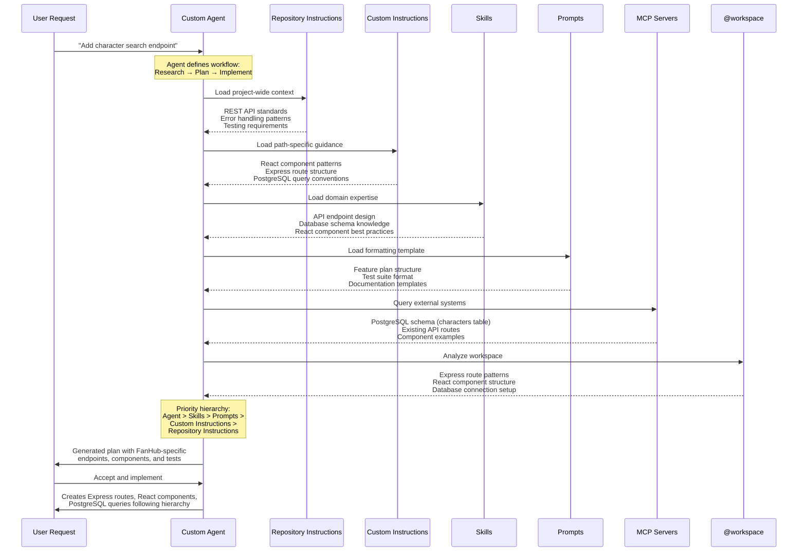

A Lap Around Copilot Customizations

> *"I've been using Copilot for six months with default settings. I just learned there's a whole ecosystem of customizations I didn't know existed. What am I missing?"*
> — Marcus, discovering the customization landscape

---

## 📖 Story So Far

Now, let's take a step back for a **comprehensive view**: **What's the full landscape of Copilot customizations, and how do they work together?** This isn't about learning one specific feature—it's about understanding the **complete customization ecosystem** and when to use each tool.

💡 **Integration Note:** This module provides a 60-minute guided tour of the entire customization landscape, showing how repository instructions, path-specific instructions, chat variables, and extensions form a cohesive system. It's the "big picture" view that connects all modules.

---

⚠️ **Prerequisites**:
- Complete [Module 00: Orientation](../00-orientation/README.md)
- VS Code with GitHub Copilot installed
- Basic familiarity with any Copilot feature (Chat, Inline Suggestions, or Edits)

---

## 🧠 Mindful Moment: From Single Tools to Ecosystem Thinking

**Traditional thinking:** *"I'll learn each Copilot feature individually as I need it."*

**AI-native thinking:** *"Understanding the full customization landscape helps me choose the right tool for each problem."*

This isn't about memorizing every feature—it's about **pattern recognition**. When you know the full toolkit, you can quickly identify: "This is a repository instructions problem" or "This needs a custom agent." The goal: **architectural awareness of the customization ecosystem**.

---

## 💭 Common Frustrations

**Custom Instructions (path-based):**
- "Built a custom agent to enforce file layout; should’ve used `.instructions.md` with `applyTo` for folders. Violations per PR: 6→0, review rounds: 3→1."
- "Style rules only applied sometimes. Added `applyTo: "**/*.ts,**/*.tsx"` and saw lint fixes per PR drop 25→5; 40 min→10 min per review."
- "Tests kept mixing patterns. Added `applyTo: "**/__tests__/**"` for fast unit patterns and `applyTo: "**/e2e/**"` for thorough E2E. Flaky tests: 9→2 per sprint; context switching: 20→3 min."

**Plan Mode:**
- "Jumped straight into edits; spent 3 hours thrashing. Using plan mode first cut failed attempts from 4→1 and implementation time 180→60 min."
- "Ambiguous scope caused rework. Plan mode with acceptance criteria reduced PR revisions 3→1 and defects 7→2."
- "Cross-repo change lacked dependency mapping. Plan mode produced step-by-step with file links; missed files 8→0 and integration time 2 days→6 hours."

**Custom Prompts (prompt files):**
- "Wrote review prompts from scratch every time. A review.prompt.md reduced iterations 4→1 and review time 90→30 min."
- "Component scaffolding inconsistent. A scaffold.prompt.md made naming, tests, and docs consistent; fixes after build 12→3 and setup time 45→12 min."
- "Docs varied in tone. A docs.prompt.md with audience and style guide cut rewrite cycles 5→1 and creation time 3 hours→45 min."

**Repository Instructions (`copilot-instructions.md`):**
- "Team said Copilot ‘doesn’t get our stack.’ Adding architecture/build/test standards raised suggestion acceptance 15%→75% and onboarding 45→10 min."
- "Build steps failed in CI. Encoding bootstrap/build/test/lint commands reduced failed runs 6→1 per sprint and setup time 60→15 min."
- "Multi-repo workspace confusion. Each repo’s `.github/copilot-instructions.md` aligned behavior; context mistakes 10→1 per week and switch time 25→5 min."

**Agent Skills:**
- "Manually ran 12-step API validation. An Agent Skill with scripts cut steps 12→3 and time 50→12 min; error rate 20%→0%."
- "Release checks varied by engineer. A release-check.skill standardized gates; missed checks 7→0 and hotfixes per sprint 3→0."
- "Test data setup was ad hoc. A test-data.skill provisioned fixtures; env setup 90→15 min and flaky tests 8→2."

**MCP Servers (tools):**
- "Kept alt-tabbing to query APIs. An MCP server for the FanHub API moved queries into chat; investigation 20→5 min and duplicate tickets 4→0."
- "Needed DB insights mid-review. A database MCP reduced context switches 15→2 and query-to-fix 40→10 min."
- "Issue triage required external systems. GitHub MCP tools pulled PR/status data in-chat; triage per issue 12→4 min and mislabels 30%→5%."

**Custom Agents:**
- "General chat kept editing wrong areas. A frontend-only agent with limited tools cut mis-edits 6→0 and rework 8 hours→1 hour per feature."
- "Security reviews were inconsistent. A security agent with OWASP checks reduced violations 12→2 per sprint and review time 90→30 min."
- "Research tasks polluted coding threads. A read-only research agent improved focus; context loss incidents 10→1 and spec drafting 2 hours→30 min."

---

## What You'll Learn

**Copilot Customizations Overview** provides a comprehensive tour of the entire customization ecosystem—from simple instructions files to advanced extensions. You'll explore each major customization type, understand when to use each one, and see how they interact to create powerful, context-aware AI assistance.

**Time:** ~60 minutes

---

## 📌 Practices Used

| Practice | How It Applied in This Module |
|----------|-------------------------------|
| 📚 **Ecosystem Awareness** | Understood the full range of customization options before choosing implementation approaches |
| 🎯 **Right Tool for the Job** | Selected appropriate customization types based on problem characteristics (scope, complexity, context) |
| 🔄 **Layered Configuration** | Used precedence rules to create maintainable, predictable customization hierarchies |

---

### The Five Customization Types

| | **Repo Instructions** | **Custom Instructions** | **Prompts** | **Agents** | **Skills** |
|---|----------------------|------------------------|-------------|------------|-----------|
| **File** | `copilot-instructions.md` | `*.instructions.md` | `*.prompt.md` | `*.agent.md` | `SKILL.md` |
| **Location** | `.github/` | `.github/instructions/` | `.github/prompts/` | `.github/agents/` | `.github/skills/*/` |
| **Think of it as** | Project README for AI | File-specific rules | Invokable function | Multi-step workflow | Domain expert |
| **When loaded** | Always, every request | By file pattern (`applyTo`) | When you invoke it | When you @ mention it | Automatically when relevant |
| **You trigger it by** | Nothing—always on | Opening matching files | Running `/prompt-name` | Typing `@agent-name` | Just asking—Copilot decides |
| **Scope** | Whole repository | Specific file types | Specific task | Role-based workflow | Specialized knowledge |
| **Best for** | Project context | File-type consistency | Repeatable functions | Multi-step workflows | Expertise |
| **Module** | 1 | 5 | 3 | 4 | 6 |

---

### How Custom Agents Orchestrate All Customization Layers

Custom agents sit at the top of the hierarchy, orchestrating all the customization capabilities you've built in Modules 1-6. When you invoke an agent, it loads and combines context from multiple sources following a priority hierarchy.

---
